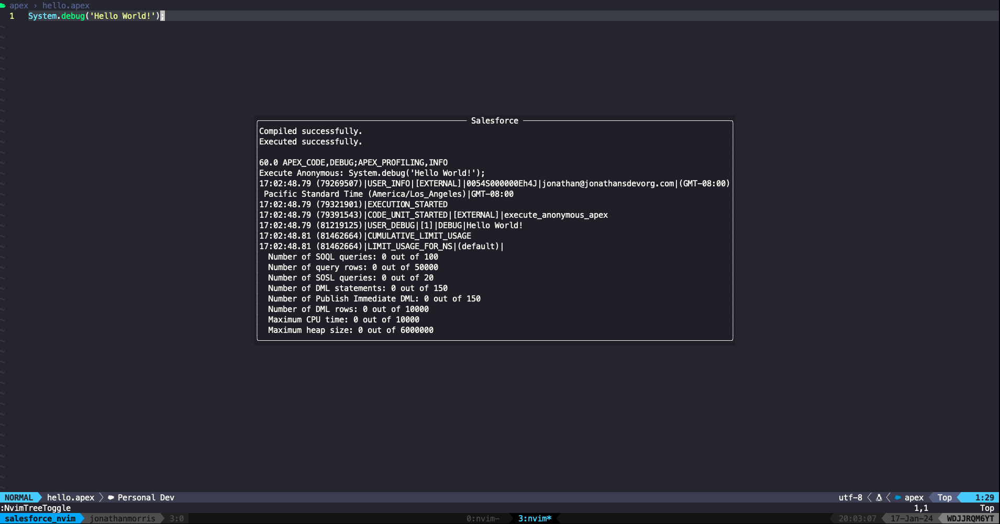
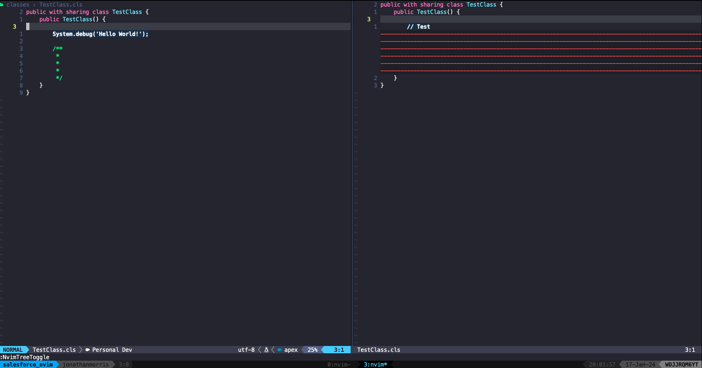

<p align="center">
  <h1 align="center">salesforce.nvim</h2>
</p>

<div align="center">
    A plugin for developing Salesforce applications within Neovim
</div>

## ⚡️ Features

Provides a set of utilities that emulate the commands of the Salesforce
extension for VS Code. Out of the box commands include:

- `:SalesforceExecuteFile`: Execute the current file as anonymous Apex
- `:SalesforceToggleCommandLineDebug`: Toggle debug logging for the console (this can also be set in the config options)
- `:SalesforceToggleLogFileDebug`: Toggle file debug logging (this can also be set in the config options)
- `:SalesforceRefreshOrgInfo`: Refresh the org info for the current project
- `:SalesforceClosePopup`: Close the popup window
- `:SalesforceRefocusPopup`: Refocus the cursor in the popup window
- `:SalesforceExecuteCurrentMethod`: Execute the test method under the cursor
- `:SalesforceExecuteCurrentClass`: Execute all test methods in the current class
- `:SalesforcePushToOrg`: Push the current file to the org
- `:SalesforceRetrieveFromOrg`: Pull the current file from the org
- `:SalesforceDiffFile`: Diff the current file against the file in the org
- `:SalesforceSetDefaultOrg`: Set the default org for the current project





## 📋 Installation

A minimal configuration is as follows:

<div align="center">
<table>
<thead>
<tr>
<th>Package manager</th>
<th>Snippet</th>
</tr>
</thead>
<tbody>
<tr>
<td>

[wbthomason/packer.nvim](https://github.com/wbthomason/packer.nvim)

</td>
<td>

```lua
use {
    "jonathanmorris180/salesforce.nvim",
    requires = {
        "nvim-lua/plenary.nvim",
        "nvim-treesitter/nvim-treesitter"
    }
}
```

</td>
</tr>
<tr>
<td>

[junegunn/vim-plug](https://github.com/junegunn/vim-plug)

</td>
<td>

```lua
Plug "jonathanmorris180/salesforce.nvim"
    Plug "nvim-lua/plenary.nvim"
    Plug "nvim-treesitter/nvim-treesitter"
```

</td>
</tr>
<tr>
<td>

[folke/lazy.nvim](https://github.com/folke/lazy.nvim)

</td>
<td>

```lua
{
    "jonathanmorris180/salesforce.nvim",
    dependencies = {
        "nvim-lua/plenary.nvim",
        "nvim-treesitter/nvim-treesitter",
    }
}
```

</td>
</tr>
</tbody>
</table>
</div>

## ☄ Getting started

To use this plugin, ensure you have the Salesforce CLI installed on your machine. If you don't have it installed, you can do so [here](https://developer.salesforce.com/tools/salesforcecli).

## ⚙ Configuration

There are a number of options available to configure `salesforce.nvim`. See the defaults below.

> **Note**: The options are also available in Neovim at `:h salesforce`

```lua
require("salesforce").setup({
    debug = {
        to_file = false,
        to_command_line = false,
    },
    popup = {
        -- The width of the popup window.
        width = 100,
        -- The height of the popup window.
        height = 20,
        -- The border characters to use for the popup window
        borderchars = { "─", "│", "─", "│", "╭", "╮", "╯", "╰" },
    },
    file_manager = {
        ignore_conflicts = false,
    },
    org_manager = {
        default_org_indicator = "󰄬",
    },
})
```

To add the default org to lualine, add the table with `require` below to `lualine.setup` (copy from here to include the Salesforce nerd font icon):

```lua
lualine.setup({
    -- include the rest of your setup
    sections = {
        lualine_c = {
            "filename",
            {
                "require'salesforce.org_manager':get_default_alias()",
                icon = "󰢎",
            },
        },
    },
})
```

## ⌨ Contributing

PRs and issues are always welcome. Make sure to provide as much context as possible and follow the template when opening one.

## 🎭 Debugging

When debugging is enabled via `:SalesforceToggleLogFileDebug`, the log file is written to

```lua
vim.fn.stdpath("cache") .. "/salesforce.log"
```
